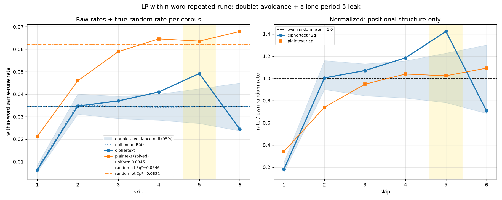
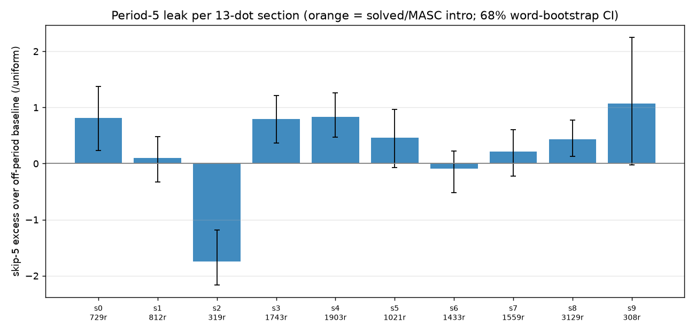
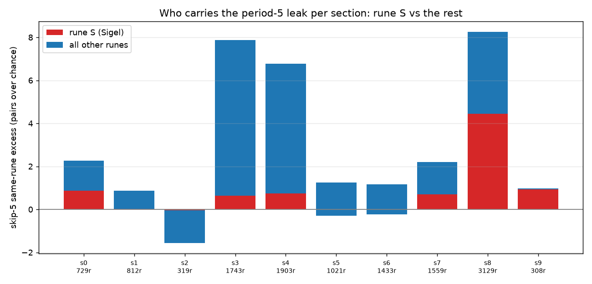

# Characterization: Within-Word Repeated-Rune Structure (period-5 leak, per-section, and the Sigel)

## Claim

Inside a word, the ciphertext repeats a rune at a fixed distance at the chance
rate for every distance **except 5**, where the rate rises to 1.43× a
doublet-aware baseline. That skip-5 bump is a period-5 leak of the plaintext's
own frequency structure, running at a duty cycle of **π(5) ≈ 0.54**. The leak is
**section-dependent** (s3, s4 strong; s2 actively anti-period-5 with a zero
skip-5 rate), and its single strongest rune, **ᛋ (Sigel)**, is not a general
driver but a marker localized to section **s8**, where whole runs (`ᛋᛞᛝ`, `ᛈᛋ`)
repeat at distance 5 inside one word.

## Status

**Status**: confirmed (characterization) for the decomposition and the
per-section map; the s8 block-echo crib is a lead on small N (2–3 events).

Corpus: `data/page0-56.txt`, the clean unsolved corpus (sections 0–9; 12,956
runes, 2,928 words). Corroborates [d5-partial-alphabet-leak.md](d5-partial-alphabet-leak.md);
adds the doublet-null decomposition, the duty cycle, the per-section map, and the
Sigel/block-echo localization.

## Evidence — the curve: doublet avoidance + a lone period-5 leak



For each skip *d*, the within-word same-rune rate factors as

    R_ct(d) = π(d)·R_pt(d) + (1 − π(d))·B(d)

- **B(d)** is the doublet-avoidance baseline — the rate under a null that keeps
  the exact rune frequencies and the observed adjacent-doublet rate but destroys
  all positional structure (`c3301.low_doublet_null`). B(1) ≈ 0, B(d≥2) ≈ chance.
- **R_pt(d)** is the plaintext same-rune rate; on-alphabet pairs pass a
  substitution bijectively, so plaintext equality survives.
- **π(d)** is the fraction of distance-*d* within-word pairs sharing a key
  element. For cyclic period-5, π(d)=1 when d ≡ 0 (mod 5), else 0.

Measured (ciphertext R_ct over the null B):

| skip | 1 | 2 | 3 | 4 | 5 | 6 |
|---|---|---|---|---|---|---|
| R_ct / B | 0.91 | 0.98 | 1.08 | 1.20 | **1.43** | 0.71 |

The ciphertext tracks the doublet null everywhere except skip 5. Two cautions the
null settles:

- **Skip 1 is entirely doublet avoidance** — R_ct sits on B, so the empty skip-1
  diagonal says nothing about words.
- **The plaintext "echo" is mostly frequency.** Chance same-rune rate Σp² is
  0.035 for the ciphertext (flat unigrams) but 0.062 for runeglish plaintext.
  Normalized by each corpus's own chance rate (right panel), plaintext has *no*
  positional structure at skip 5 — it just carries a higher frequency floor, and
  the bump is that floor leaking through the period.

Duty cycle: π(5) = (R_ct − B)/(R_pt − B) = (0.049 − 0.035)/(0.062 − 0.035) ≈ **0.54**.

## Evidence — the leak varies by section



**Sectioning.** The project's editorial `$`/`%`/`&` dividers (`SYMBOLS.md` calls
them disputed) over-segment into title-sized slivers. The real on-page divider is
the 13-dot glyph ⑬ (27 in page0-56). Splitting on it and merging each title
fragment forward into its body gives 10 body-sized sections, no slivers.

**Metric.** The *period-5 excess* is the skip-5 rate minus that section's own
off-period baseline (mean of skips 2, 3, 4, 6). A solved monoalphabetic section
sits high at every skip so its excess is ~0; a period-5 leak lifts skip 5 above a
chance baseline; a flat section is ~0 everywhere.

| section | runes | excess (/uniform) | 68% CI | reading |
|---|---|---|---|---|
| s3 | 1743 | +0.80 | [+0.37, +1.22] | strong period-5 |
| s4 | 1903 | +0.83 | [+0.47, +1.26] | strong period-5 |
| s0 | 729 | +0.81 | [+0.23, +1.38] | strong period-5 |
| s8 | 3129 | +0.43 | [+0.13, +0.78] | moderate (Sigel-carried) |
| s5, s7 | — | +0.2…+0.5 | includes 0 | weak |
| s1, s6 | — | ~0 | includes 0 | flat, no period-5 |
| **s2** | 319 | **−1.74** | [−2.16, −1.19] | **anti**: skip-5 rate is 0 |

The global "one ~50%-open channel" is an average over different sections. **s2**
is the outlier: skip-5 empty while skip-4 (2.1×) and skip-6 (2.6×) are high — not
period-5, but something with even-distance structure. It is small (319 runes), so
the period is not yet pinned.

## Evidence — the Sigel, and where it sits



Corpus-wide, ᛋ is the strongest single contributor to the skip-5 leak: **11
same-Sigel-at-distance-5 pairs vs 2.3 expected (~4.8×)**, 29% of the whole excess
from one of 29 runes. But the split by section shows this is one section, not a
general rule:

- **s8** holds 5 of the 11 pairs (vs 0.6 expected); Sigel carries ~54% of s8's leak.
- The strongest sections **s3, s4** barely use Sigel (~8–11%); their leak spreads
  across other runes.

**Why s8: block echoes.** The Sigel-at-5 pairs in s8 are embedded in runs that
repeat at distance 5 inside one word, with Sigel at the edge:

```
w599   ᛋ ᛞ ᛝ  ᚷ ᛚ  ᛋ ᛞ ᛝ     SDNG · GL · SDNG   trigram repeats at d=5
        0 1 2   3 4  5 6 7

w16    ᚢ ᛈ ᛋ ᚦ ᛁ ᚳ ᛈ ᛋ ᛁ ᚹ    U P S TH I C P S I W    bigram PS repeats at d=5
        0 1 2 3 4 5 6 7 8 9        (pos 1–2 → 6–7)
```

A ciphertext block that repeats at distance 5 inside a word is the clean
fingerprint of period-5: ciphertext[i…i+k] = ciphertext[i+5…i+5+k] exactly when
the plaintext block repeats and both copies land on the same key elements. These
echoes are rare — 0.35 expected in s8 by chance, 2–3 observed (~6–8×, Poisson
p ≈ 0.05) — and s8 has the most of any section.

## Cribs for the length-3 block echo

The trigram echo `ᛋᛞᛝ·ᚷᛚ·ᛋᛞᛝ` (word w599, section s8) is the **only** length-3
within-word echo at distance 5 in the whole clean corpus. It forces a plaintext
of shape `[A B C][d e][A B C]` — a plaintext-structure constraint that holds for
*any* cipher, independent of family.

**Note — w599 spans a line wrap.** In the raw transcription it reads
`ᛋᛞ / ⏎ ᛝᚷᛚᛋᛞᛝ`: no dots (it is bounded by ① word separators), with a line wrap
between runes 2 and 3. Line wraps are not word boundaries — words flow through
them, which is the tokenisation that yields the canonical 2,928 words — so w599 is
a single word and the echo is genuine. Its second half happens to be
line-initial; noted only because that is where the transcription recovered dropped
marks, not because it changes the reading.

The shape is rare, which is what makes the crib strong:

- **English lexicon (top 200k):** only 14 words fit, mostly plurals and proper
  nouns. The one common real word is **`restores`** (R·E·S · T·O · R·E·S);
  next are `insulins`, `einstein`.
- **LP register vocabulary:** **zero** words have a trigram repeat at distance 5.
  So if w599 is a repeated-trigram word, it is not in the known Cicada register.

**Not a Vigenère.** It is pointless to read this crib as a per-position additive
(Vigenère) or Beaufort key. A per-position-bijective cipher produces ciphertext
doublets at chance, but the LP suppresses doublets 5.2× below chance
([doublet-suppression-requires-design.md](doublet-suppression-requires-design.md)):
sub-chance doublets force a tuned permutation relation between adjacent alphabets,
which a shift or reflection key does not have. So the crib is kept as a plaintext
constraint (plaintext[0:3] = plaintext[5:8], candidate `restores`), not as a
route to a stream key.

## Scripts

- `experiments/within_word_period_leak.py` — the decomposition, the per-section
  map, and the Sigel split; writes the three figures above.
- `aldegonde.analysis.coincidence.within_word_match_rate` — the within-word
  same-rune rate primitive (tested).

## Related

- [d5-partial-alphabet-leak.md](d5-partial-alphabet-leak.md), [within-word-d5-coincidence.md](within-word-d5-coincidence.md) — the d5 same-alphabet leak and coincidence excess this corroborates and extends.
- [doublet-suppression.md](doublet-suppression.md), [doublet-suppression-requires-design.md](doublet-suppression-requires-design.md) — skip-1, and why the crib is not a Vigenère.
- [long-word-structure.md](long-word-structure.md) — long words carry no structure beyond the d5 echo.
- [aligned-kappa-no-reset.md](aligned-kappa-no-reset.md) — no keystream reset at page/section boundaries (bears on the s2 outlier and any phase model).

## Verdict

The within-word repeat structure is doublet avoidance plus a single period-5
leak at ~54% duty cycle, unevenly distributed across sections. s2 (anti-period-5)
and the unique s8 trigram echo `ᛋᛞᛝ` are the two concrete leads.
